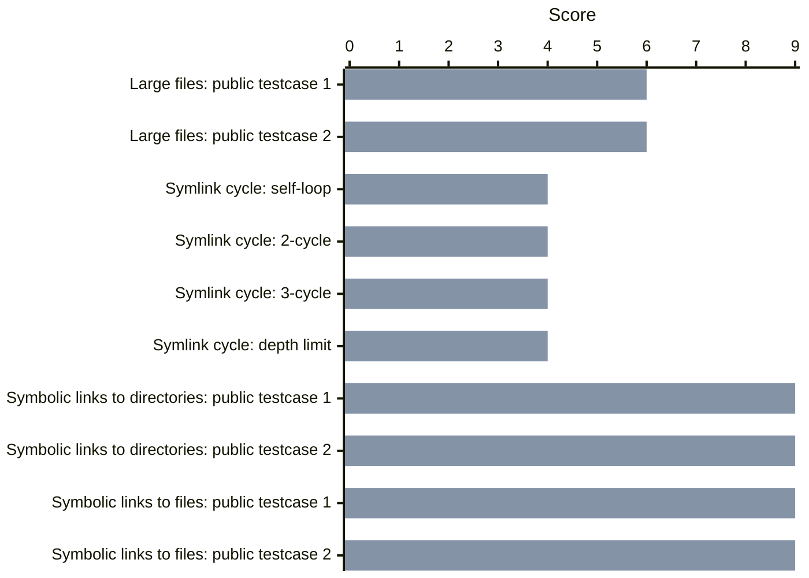

## Information

- **Student ID**: R14946009
- **Name**: R14946009
- **GitHub Username**: R14946009

## Grades

```mermaid
xychart-beta horizontal
    x-axis ["  Large files: public testcase 1", "  Large files: public testcase 2", "  Symlink cycle: self-loop", "  Symlink cycle: 2-cycle", "  Symlink cycle: 3-cycle", "  Symlink cycle: depth limit", "  Symbolic links to directories: public testcase 1", "  Symbolic links to directories: public testcase 2", "  Symbolic links to files: public testcase 1", "  Symbolic links to files: public testcase 2"]
    y-axis "Score" 0 --> 9.0
    bar [6.0, 6.0, 4.0, 4.0, 4.0, 4.0, 9.0, 9.0, 9.0, 9.0]
    bar [6.0, 6.0, 4.0, 4.0, 4.0, 4.0, 9.0, 9.0, 9.0, 9.0]
```
